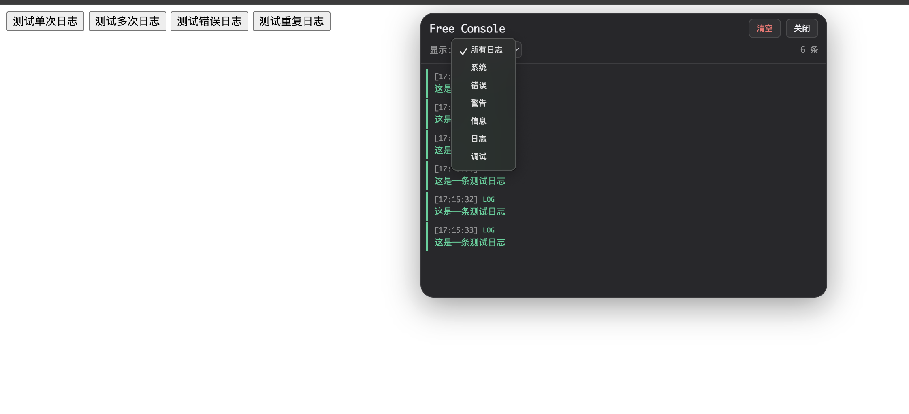

# 🚀 Free Console

## 一个浏览器扩展

  <!-- Logo -->
  

  <!-- Project Description -->
  
<strong>一键打开浏览器开发者控制台</strong>

  <!-- Screenshot -->
  

---

## 📖 简介

快速打开浏览器开发者控制台的便捷工具，省去繁琐步骤，一键直达。

## 🎯 使用方法

1. 安装扩展
2. 点击扩展图标
3. 立即打开控制台
